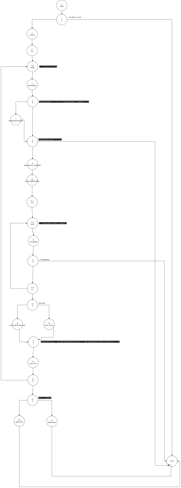

# SI_2024_lab2_223100
# Петар Гоговски 223100

## 3. Цикломатска комплексност
Цикломатската комплексност се пресметува со формулата: E−N+2P. Според мојот граф имаме:
Е(Рабови)=29
N(Јазли)=26
Р(Број на поврзани компоненти)=1

29-26+2*1 = 5

## 4. Тест случаи за Every Branch
За критериумот Every Branch треба да направиме тест случаи што ќе ја поминат секоја гранка(секој if). Имаме вкупно 7 гранки во нашата функција, и за нив тест случаите би биле:

1. if (allItems == null)
    За оваа гранка имаме 2 можни случаи во кои би бил точен if-от:
    -allItems = null 
    -allItems да биде празна листа

2. if (item.getName() == null || item.getName().length() == 0)
    И за оваа гранка имаме 2 случаи, 
    -item.getName() = null - би бил исполнет ако името на предметот е null, односно ако предметот изгледа вака: (null, "12345", 100, 0)
    -item.getName().length() = 0 - би бил исполнет ако името на предметот е празен стринг, односно предметот изгледа вака: ("", "12345", 100, 0)

4.if (item.getBarcode() != null)
    Единствен случај за да влезе во оваа гранка е item.getBarcode() = null.

5.if (allowed.indexOf(c) == -1)
    За оваа гранка потребно е item.getBarcode да содржи невалиден карактер, односно било кој карактер што не е цифра. Една можна вредност е "74839c5"

6.if (item.getDiscount() > 0)
    За оваа гранка item.discount треба да биде поголемо од 0, односно може да ја има вреснота 0.2, што би значеко дека за тој продукт има 20% попуст.

7.if (item.getPrice() > 300 && item.getDiscount() > 0 && item.getBarcode().charAt(0) == '0')
    За оваа гранка треба да бидат исполнети 3 услови, и тоа:
    -item.getPrice() > 300 - цената на продуктот да биде поголема од 300
    -item.getDiscount() > 0 -  да имаме попуст на тој продукт
    -item.getBarcode().charAt(0) == '0' - баркодот на продуктот да почнува на 0

Пример за таков продукт е ("Mleko", "0435234", 350, 0.15)

8.if (sum <= payment)
    За оваа гранка потребно е сумата од цените на сите прозводи да биде помала или еднаква со сумата на средства со кои располагаме, payment. Може да внесеме ("Mleko", "0435234", 350, 0.15), ("Leb", "563456", 50, 0.1), ("Banani", "866435634", 120, 0.5) како предмети и 3000 како payment.

## 5. Тест случаи за Multiple Condition 
Условот if "(item.getPrice() > 300 && item.getDiscount() > 0 && item.getBarcode().charAt(0) == '0')" има 3 подуслови:

1.item.getPrice() > 300
2.item.getDiscount() > 0 
3.item.getBarcode().charAt(0) == '0'

тоа значи дека би имале 2^3 = 8 можни комбинации

.    1       2       3       final
1   True    True    True    True
2   True    True    False   False
3   True    False   True    False
4   True    False   False   False
5   False   True    True    False
6   False   True    False   False
7   False   False   True    False
8   False   False   False   False

Првиот ред, односно случајот 1 е единствениот случај каде првичниот услов е True. Тоа е така бидејќи ова е единствениот случај каде имаме True за секој од посусловите, а тоа ни е потребно бидејќи имаме && во главниот услов. Еден пример за ваков случај е ("Mleko", "0435234", 350, 0.15).

Во сите останати редови/случаи имаме барем по еден False во колоните за подусловите, што значи дека дека ќе имаме False и за крајата вредност, односно вредноста на првичниот услов. Тоа се случува бидејќи еден од параметрите на предметот не го исполнува условот, на пример:
("Leb", "563456", 500, 0.1) каде баркодот не започнува на 0 или ("Banani", "023423", 120, 0.5) каце цената е помала од 300.
